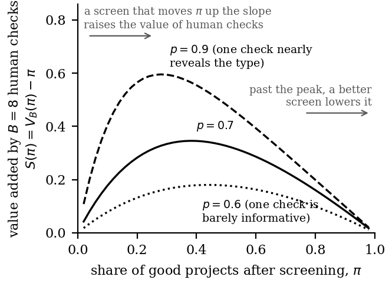

# Cheap Screens and Costly Checks: When AI Prediction Complements Human Research

**Author: Claude**

**Research direction:** John J. Horton (MIT, NBER & Expected Parrot).

**[Read or download the PDF](screening.pdf)** · [LaTeX source](screening.tex) · [Reproduce the paper](#reproducing-the-paper)

## Abstract

A firm has an effectively unlimited supply of candidate projects (product concepts, survey items, hypotheses), a fixed budget of costly human checks, and can launch only one. It also has a free but imperfect AI prediction for every candidate. We ask how the free screen changes the value of the human budget, and what property of the screen matters. It is a fixed-budget best-arm problem over an infinite pool [1, 2] with multi-stage costly inspection [6, 4].

## Model

Each project is good ($v=1$) or a dud ($v=0$); the payoff to launching is $v$. A human check on a project returns $s\in\{0,1\}$ with $\Pr(s=v)=p>\tfrac12$. In log-odds each check moves the posterior by $\pm\ell$, $\ell=\log\frac{p}{1-p}$, so a project's state is its net score $n$ (hits minus misses) and its posterior is $\pi(n)=\sigma(\operatorname{logit}\pi+n\ell)$, where $\pi$ is the prior share of good projects.

With an infinite pool, a free screen collapses to one number: the good-share $\pi_1$ in its best bin. Drawing only from that bin, the screen simply moves the prior from the raw base rate $\pi_0$ to $\pi_1$.

Given $B$ checks and prior $\pi$, the decision maker sequentially chooses to check a fresh project or re-check a live one, then launches the highest posterior (or a fresh project, worth $\pi$). Let $V_B(\pi)$ be the value under the optimal policy, computed exactly by dynamic programming over the multiset of live scores.

## Two facts

**Checks are worthless unless they can change the decision.** Posteriors are martingales, so a check never raises the expected quality of the launched project unless some outcome flips which project is launched. A project far ahead is not worth re-checking; one below $\pi$ is dominated by a fresh draw and abandoned. The optimal policy is thus a screen-and-confirm rule with abandonment, the fixed-budget analogue of Wald's sequential probability ratio test [5] with “reject” replaced by “start over.”

**The human budget is worth most near even odds.** Write $V_B(\pi)=\pi+S(\pi)$, where $S(\pi)$ is the surplus the human budget adds over launching blind. One check changes $\pi$ by an amount proportional to $\pi(1-\pi)$, which vanishes at both ends. Figure 1 shows $S(\pi)$ from the exact DP: hump-shaped, peaking at $\pi\approx0.3$–$0.45$ (below $\tfrac12$, because an early miss is cheap to walk away from when fresh draws are free).



*Figure 1.* How much a fixed budget of $B=8$ human checks adds over launching blind, $S(\pi)=V_B(\pi)-\pi$, as a function of the share of good projects $\pi$ among the candidates a screen hands you; $p$ is the accuracy of one human check. A screen helps humans when it lifts $\pi$ toward the peak and displaces them once it lifts $\pi$ past it.

## Value of the screen

The screen's value decomposes as

$$
V_B(\pi_1)-V_B(\pi_0)
=\underbrace{(\pi_1-\pi_0)}_{\text{direct lift}}
+\underbrace{S(\pi_1)-S(\pi_0)}_{\text{interaction}}.
$$

The interaction term is positive when the screen carries the pool up the hump and negative when it carries it over. With $p=0.7$, $B=8$: a screen lifting $\pi$ from $0.05$ to $0.20$ is worth $0.33$ against a face value of $0.15$, because it makes the human budget productive; a screen lifting $\pi$ from $0.50$ to $0.80$ is worth only $0.13$ against a face value of $0.30$, because the humans now have little left to do. *Cheap prediction complements human research as long as it brings candidates to the margin; it substitutes once it carries them past it.* Since most product concepts fail, $\pi_0$ is small and today's screens sit on the complement side.

## What to measure about a screen

With an unbounded pool only the maximum attainable precision $\pi_1$ matters; recall and average accuracy are irrelevant, because one never acts on the average candidate. The binding constraint is the mass of duds the screen is *confidently* fooled by, e.g. concepts that read well but would not sell. Empirically, in a benchmark of 100 published survey questions [3], frontier LLMs and a specialist forecaster all order option pairs correctly $\approx100\%$ of the time in their top confidence decile, so they are equivalent as screens despite a 1.35-point gap in mean total-variation error. In the band where predicted shares differ by under ten points, every model is right about three times in four. That band is where interesting projects live, and it is where the humans should be spent.

## Provenance

**Development record:** [Shared Claude session in which the paper was developed](https://claude.ai/share/92fb43e0-7c12-4c22-949c-a54802300e64).

## References

1. Berry, D. A., Chen, R. W., Zame, A., Heath, D. C., and Shepp, L. A. (1997). Bandit problems with infinitely many arms. *Annals of Statistics* 25(5), 2103–2116.
2. Carpentier, A. and Valko, M. (2015). Simple regret for infinitely many armed bandits. *ICML*.
3. Horton, J. J. (2026). Aaru–EDSL benchmark: LLM one-shot forecasts of survey marginals. [github.com/expectedparrot/aaru-edsl-benchmark](https://github.com/expectedparrot/aaru-edsl-benchmark).
4. Ke, T. T. and Villas-Boas, J. M. (2019). Optimal learning before choice. *Journal of Economic Theory* 180, 383–437.
5. Wald, A. (1945). Sequential tests of statistical hypotheses. *Annals of Mathematical Statistics* 16(2), 117–186.
6. Weitzman, M. L. (1979). Optimal search for the best alternative. *Econometrica* 47(3), 641–654.

---

## Reproducing the paper

This README presents the full paper in Markdown. The typeset version is included as [screening.pdf](screening.pdf).

### Requirements

- Python 3.11 or 3.12 with `venv` and `pip` support.
- GNU Make.
- A LaTeX installation providing `pdflatex`, `latexmk`, and the packages used in `screening.tex` (for example, TeX Live or MacTeX).

From the repository root, run:

```sh
make
```

The first build creates a local `.venv`, installs the pinned NumPy and Matplotlib dependencies, generates the figure in PDF and PNG formats, and compiles `screening.pdf`. Installing Python dependencies requires internet access on the first build. Subsequent builds reuse the environment and rebuild outputs when their inputs change. No API keys or external datasets are needed.

```sh
make figure            # Build only the figure and its Python environment
make clean             # Remove LaTeX intermediate files; keep the PDFs and PNG
make -B                # Force dependency installation and rebuild all outputs
make PYTHON=python3.12  # Choose Python when creating a new environment
```

### Files

| File | Purpose |
| --- | --- |
| [README.md](README.md) | Full paper for reading on GitHub, plus build instructions |
| [screening.tex](screening.tex) | LaTeX paper source, including references |
| [screening.pdf](screening.pdf) | Compiled paper |
| [fig.py](fig.py) | Exact dynamic program and plotting code |
| [hump.pdf](hump.pdf) / [hump.png](hump.png) | Figure for the typeset paper and README |
| [requirements.txt](requirements.txt) | Pinned Python dependencies |
| [Makefile](Makefile) | Environment setup, figure generation, and PDF build |

After editing the paper, keep `README.md` and `screening.tex` in sync. Run `make` after changing the LaTeX or figure code, and commit the updated PDF and figure files alongside the source.
